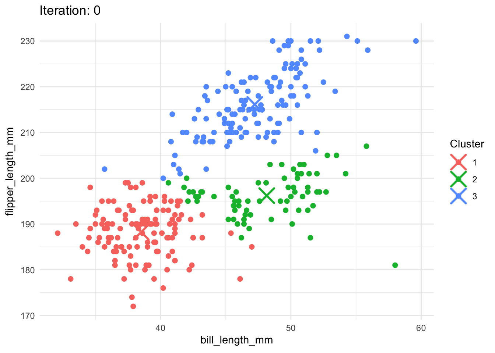

## 1a. K-Means


```{r, echo=FALSE, message=FALSE, warning=FALSE}

# Load libraries
library(tidyverse)
library(ggplot2)
library(cluster)
library(gganimate)
library(gifski)

# Step 1
# Step 1a: Load data
penguins <- read.csv("palmer_penguins.csv")

# Step 1b: Prepare data
penguins_data <- penguins %>% 
  select(bill_length_mm, flipper_length_mm) %>% 
  drop_na() 

# Steb 1c: Euclidean distance
euc_dist <- function(a, b) {
  sqrt(rowSums((t(t(a) - as.numeric(b)))^2))
}

# Step 2: K-means 
# Step 2a: Define K-means
my_kmeans <- function(data, K, max_iter = 10) {
  set.seed(42)
  n <- nrow(data)
  centroids <- data[sample(1:n, K), ]
  cluster_assignments <- rep(0, n)
  all_iterations <- list()

  for (i in 1:max_iter) {
    
    # Step 2b: Assign clusters
    dists <- sapply(1:K, function(k) euc_dist(data, centroids[k, ]))
    cluster_assignments <- apply(dists, 1, which.min)
    all_iterations[[i]] <- tibble(data, 
                                  cluster = factor(cluster_assignments),
                                  iter = i,
                                  id = 1:n)

    # Step 2c: Update centroids
    new_centroids <- centroids
    for (k in 1:K) {
      if (sum(cluster_assignments == k) > 0) {
        new_centroids[k, ] <- colMeans(data[cluster_assignments == k, , drop = FALSE])
      }
    }

    if (all(new_centroids == centroids)) break
    centroids <- new_centroids
  }

  list(clusters = cluster_assignments,
       centroids = centroids,
       iterations = bind_rows(all_iterations))
}

# Step 3: Run custom K-means
k <- 3
result <- my_kmeans(penguins_data, K = k, max_iter = 10)

# Step 4: Run built-in kmeans() before animation

# Step 4a: Standardize and sort custom centroids
sorted_centroids <- as.data.frame(result$centroids)
colnames(sorted_centroids) <- c("bill_length_mm", "flipper_length_mm")
sorted_centroids$custom <- 1:3

# Step 4b: Sort: bottom left → middle → top right
sorted_centroids <- sorted_centroids %>%
  arrange(flipper_length_mm, bill_length_mm) %>%
  mutate(desired_label = 1:3)  # red, green, blue order
k_built <- kmeans(penguins_data, centers = k, nstart = 10)
```

### Elbow Method

The Elbow Plot shows how the total within-cluster sum of squares (WCSS) changes as we increase the number of clusters (K). A lower WCSS means that the points within each cluster are closer to the center. As we increase K, WCSS continues to drop, but the improvement slows down. In this case, the 'elbow' appears at K = 3, suggesting that using 3 clusters balances simplicity and accuracy well.

```{r, echo=FALSE, message=FALSE, warning=FALSE}
# Step 5: Elbow Plots
wcss <- numeric(6)
sil_scores <- numeric(6)

for (k in 2:7) {
  km <- kmeans(penguins_data, centers = k, nstart = 10)
  wcss[k - 1] <- sum(km$withinss)
  sil <- silhouette(km$cluster, dist(penguins_data))
  sil_scores[k - 1] <- mean(sil[, 3])
}

# Plot WCSS
qplot(2:7, wcss, geom = 'line') + 
  labs(x = 'Number of Clusters (K)', y = 'WCSS', title = 'Elbow Method') + 
  theme_minimal()
```

### Silhouette Score

The Silhouette Score tells us how well-separated the clusters are. Higher scores (closer to 1) mean better-defined clusters. Our silhouette plot shows a peak at K = 3, indicating that this number of clusters gives the clearest groupings. Scores above 0.5 suggest that the clustering is meaningful.

```{r, echo=FALSE, message=FALSE, warning=FALSE}
# Step 6: Silhouette Plot
qplot(2:7, sil_scores, geom = 'line') + 
  labs(x = 'Number of Clusters (K)', y = 'Avg Silhouette Score', title = 'Silhouette Analysis') + 
  theme_minimal()
```

### Custom vs. Built-in K-Means

We wrote our own implementation of the K-means algorithm and compared it with R's built-in kmeans() function. The two methods produced nearly identical results. Visually, the groupings of data points were consistent between both methods. This confirms our implementation works correctly. Here is are the three clusters plotted.


```{r, echo=FALSE, message=FALSE, warning=FALSE}
# Step 7: Compare with built-in kmeans()

# Match built-in clusters to spatial labels (1=red, 2=green, 3=blue)
centroid_coords <- as.data.frame(k_built$centers)
colnames(centroid_coords) <- c("bill_length_mm", "flipper_length_mm")

# Assign label by spatial sorting
centroid_coords$builtin <- 1:3
centroid_coords <- centroid_coords %>%
  arrange(flipper_length_mm, bill_length_mm) %>%
  mutate(new_cluster = 1:3)  # red → green → blue

# Create mapping table
reverse_match <- centroid_coords %>%
  select(builtin, new_cluster) %>%
  rename(cluster = builtin)

penguins_clustered <- penguins_data %>%
  mutate(cluster = k_built$cluster, type = "point") %>%
  left_join(reverse_match, by = "cluster") %>%
  mutate(cluster = factor(new_cluster))

# Update centroids to match remapped cluster labels
centroids_df <- as.data.frame(k_built$centers)
colnames(centroids_df)[1:2] <- c("bill_length_mm", "flipper_length_mm")
centroids_df$orig_cluster <- 1:3
centroids_df <- centroids_df %>%
  left_join(reverse_match, by = c("orig_cluster" = "cluster")) %>%
  mutate(cluster = factor(new_cluster), type = "centroid")

# Combine for plot

# Combine centroid and point data to enforce consistent colors
# Reuse aligned cluster labels
penguins_clustered$type <- "point"
centroids_df$type <- "centroid"

plot_final <- bind_rows(
  penguins_clustered %>% select(bill_length_mm, flipper_length_mm, cluster, type),
  centroids_df %>% select(bill_length_mm, flipper_length_mm, cluster, type)
)

ggplot(plot_final, aes(x = bill_length_mm, y = flipper_length_mm, color = cluster)) + 
  geom_point(data = subset(plot_final, type == "point"), size = 2) + 
  geom_point(data = subset(plot_final, type == "centroid"), shape = 4, size = 6, stroke = 2) +
  labs(title = "Final K-Means Clustering Result (K = 3)", color = "Cluster") + 
  theme_minimal()

```

```{r, echo=FALSE, message=FALSE, warning=FALSE}
# Step 8: Plot animated iterations with centroids

# Add iteration 0 to visualize starting centroids
initial_centroids <- result$iterations %>%
  filter(iter == 1) %>%
  mutate(iter = 0)

result$iterations <- bind_rows(initial_centroids, result$iterations)

# Reconstruct aligned iterations with centroid position per frame
aligned_iterations <- result$iterations %>%
  mutate(cluster = as.integer(as.character(cluster))) %>%
  left_join(sorted_centroids, by = c("cluster" = "custom")) %>%
  mutate(cluster = factor(desired_label))

centroid_frames <- aligned_iterations %>%
  group_by(iter, cluster) %>%
  summarise(
    bill_length_mm = mean(bill_length_mm.x),
    flipper_length_mm = mean(flipper_length_mm.x),
    .groups = "drop"
  ) %>%
  mutate(type = "centroid")

point_frames <- aligned_iterations %>%
  mutate(bill_length_mm = bill_length_mm.x,
         flipper_length_mm = flipper_length_mm.x,
         type = "point") %>%
  select(bill_length_mm, flipper_length_mm, cluster, iter, type)

plot_data <- bind_rows(point_frames, centroid_frames)

p <- ggplot(plot_data, aes(x = bill_length_mm, y = flipper_length_mm)) +
  geom_point(data = subset(plot_data, type == "point"), aes(color = cluster), size = 2) +
  geom_point(data = subset(plot_data, type == "centroid"), aes(color = cluster), shape = 4, size = 6, stroke = 1.5) +
  labs(title = 'Iteration: {closest_state}', color = 'Cluster') +
  transition_states(iter, transition_length = 1, state_length = 1) +
  theme_minimal()
animated_plot <- animate(p, nframes = 10, fps = 2, renderer = gifski_renderer())
anim_save("kmeans_iterations.gif", animation = animated_plot)

```

### Animated Clustering Visualization

Below, is an animated version of the plot to show how the custom algorithm works step-by-step. The animation illustrates how centroids move and how points change cluster assignments until the groups stabilize. This helps demystify how K-means "learns" over time.




### Conlusion

Both the Elbow and Silhouette methods agree that K = 3 is the best number of clusters. Our custom implementation works as expected, and the animation gives a clear visual of how the algorithm iteratively finds clusters.

## 2b. Key Drivers Analysis

We analyzed what drives satisfaction using various statistical techniques. The table below shows different importance measures for each variable, all scaled to percentages that sum to 100% within each column.

```{r, echo=FALSE, message=FALSE, warning=FALSE}
# Load necessary libraries
library(tidyverse)
library(relaimpo)
library(randomForest)
library(caret)
library(gt)
library(scales)
library(dplyr)

# Load and clean data
df <- read.csv("data_for_drivers_analysis.csv")

# Standardize numeric predictors
df_scaled <- df %>% mutate(across(everything(), scale))

# Set target and predictors
y_var <- "satisfaction"
x_vars <- setdiff(names(df_scaled), y_var)

# Pearson Correlations
correlations <- cor(df_scaled)[, y_var, drop = FALSE] %>% 
  as.data.frame() %>% 
  rownames_to_column("Variable") %>% 
  filter(Variable != y_var) %>% 
  rename(Pearson = satisfaction)

# Standardized Regression Coefficients
lm_model <- lm(as.formula(paste(y_var, "~", paste(x_vars, collapse = "+"))), data = df_scaled)
betas <- coef(lm_model)[-1] %>% 
  as.data.frame() %>% 
  rownames_to_column("Variable") %>% 
  rename(Std_Reg_Coef = ".")

# Usefulness (drop in R2)
full_r2 <- summary(lm_model)$r.squared
usefulness_df <- map_dfr(x_vars, function(var) {
  reduced_vars <- setdiff(x_vars, var)
  reduced_model <- lm(as.formula(paste(y_var, "~", paste(reduced_vars, collapse = "+"))), data = df_scaled)
  reduced_r2 <- summary(reduced_model)$r.squared
  tibble(Variable = var, Usefulness = full_r2 - reduced_r2)
})

# Shapley and Johnson RW
relimp_model <- calc.relimp(lm_model, type = c("lmg", "genizi"), rela = TRUE)
shapley_df <- tibble(Variable = names(relimp_model$lmg), Shapley = relimp_model$lmg)
johnson_df <- tibble(Variable = names(relimp_model$genizi), Johnson_RW = relimp_model$genizi)

# Random Forest Gini
rf_model <- randomForest(as.formula(paste(y_var, "~ .")), data = df_scaled, importance = TRUE)
gini_df <- importance(rf_model, type = 2) %>%
  as.data.frame() %>%
  rownames_to_column("Variable") %>%
  rename(Gini = IncNodePurity)

# Combine
summary_table <- list(correlations, betas, usefulness_df, shapley_df, johnson_df, gini_df) %>%
  reduce(left_join, by = "Variable")

# Convert to percentages and normalize
summary_table_pct <- summary_table %>%
  mutate(across(-Variable, ~ 100 * . / sum(., na.rm = TRUE))) %>%
  mutate(across(-Variable, ~ round(., 1)))

# Build styled table
# Create green gradient palette
green_palette <- scales::col_numeric(
  palette = c("#EFF6F2", "#DDEDE2", "#BDE2C8", "#8DCF9E", "#64B87D"),
  domain = NULL
)

# Build styled table with clean green heatmap
summary_table_gt <- summary_table_pct %>%
  gt() %>%
  tab_header(
    title = md("**Key Driver Metrics Summary**"),
    subtitle = md("Feature Percentages")
  ) %>%
  fmt_number(
    columns = where(is.numeric),
    decimals = 1
  ) %>%
  fmt_percent(
    columns = where(is.numeric),
    scale_values = FALSE,
    decimals = 1
  ) %>%
  data_color(
    columns = where(is.numeric),
    colors = green_palette
  ) %>%
  cols_align(align = "center", columns = everything()) %>%
  cols_width(
    Variable ~ px(160),
    everything() ~ px(100)
  ) %>%
  tab_style(
    style = cell_borders(sides = "all", color = "gray", weight = px(1)),
    locations = cells_body()
  ) %>%
  tab_style(
    style = cell_borders(sides = "all", color = "gray", weight = px(1)),
    locations = cells_column_labels(columns = everything())
  ) %>%
  tab_style(
    style = cell_text(weight = "bold"),
    locations = cells_column_labels(columns = everything())
  ) %>%
  tab_options(
    row.striping.include_table_body = FALSE,
    row.striping.background_color = NULL,
    table.background.color = "white",
    data_row.padding = px(4)
  )

# Display the table
summary_table_gt

```

### **Metric Methods**

* **Pearson:** Measures how strongly each variable is related to satisfaction.

* **Std_Reg_Coef:** The impact each variable has on satisfaction in a regression model.

* **Usefulness:** How much predictive power is lost when a variable is removed.

* **Shapley:** Fairly distributes predictive credit among variables, accounting for overlap.

* **Johnson_RW:** A more accurate version of regression weights that considers correlation.

* **Gini:** Comes from a random forest model; shows how much each variable helps in splitting the data.

### **Key Variables**

* Impact and Trust consistently show up as top drivers across all methods.

* Service is also highly important, especially in the Shapley and Johnson methods.

* Variables like Rewarding and Popular are less influential, appearing with lower percentages.

### **Conclusion**

There is broad agreement across metrics about which variables matter most. This helps build confidence in focusing improvement efforts on a few key areas like Impact, Trust, and Service.